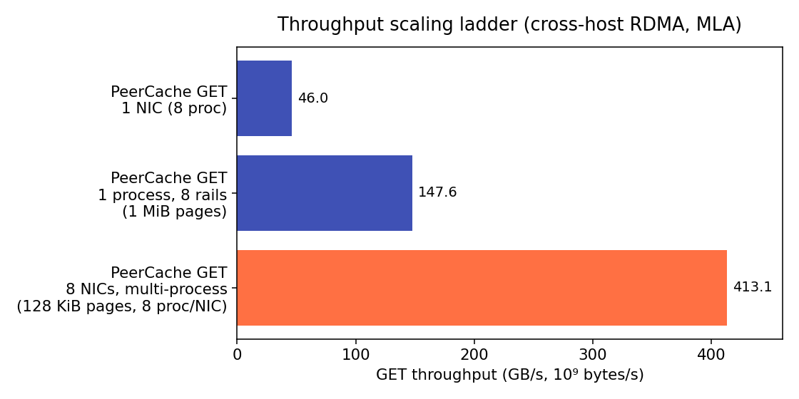
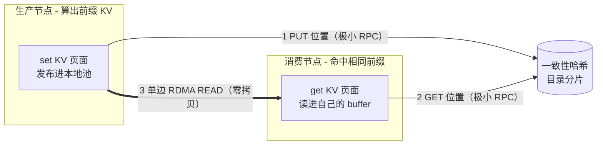
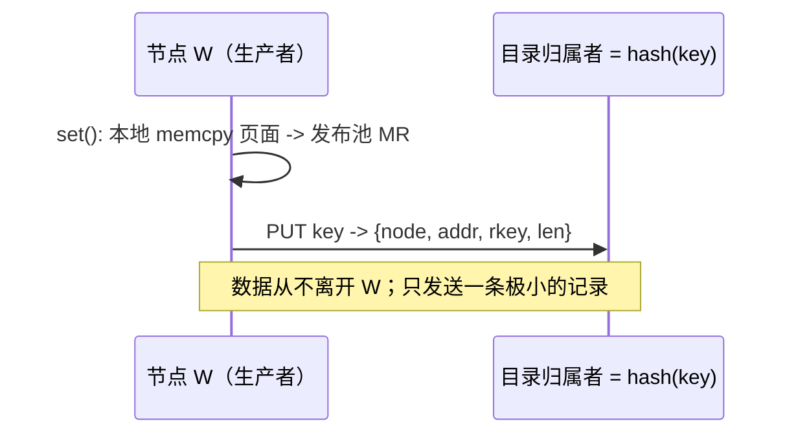
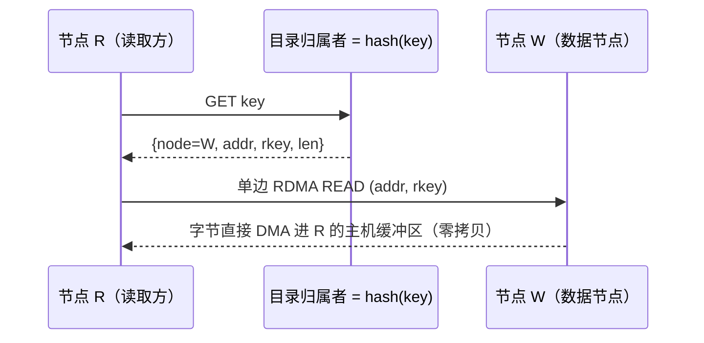
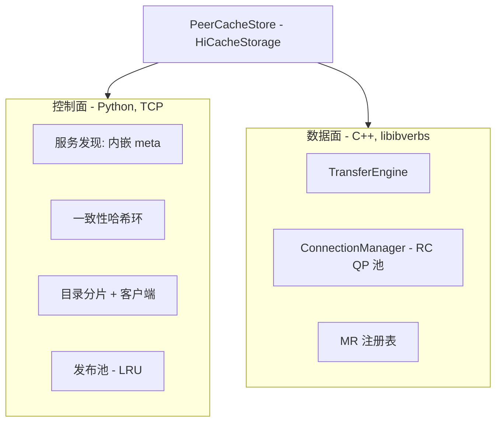
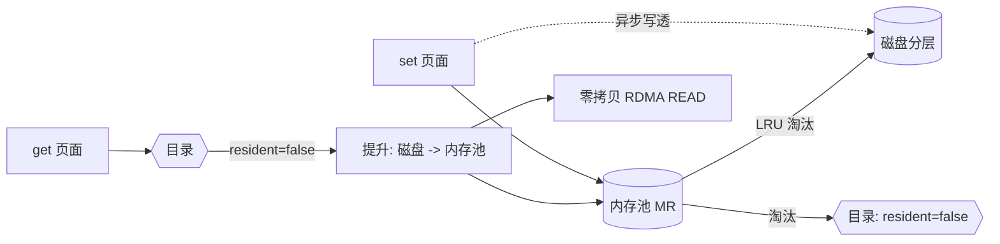
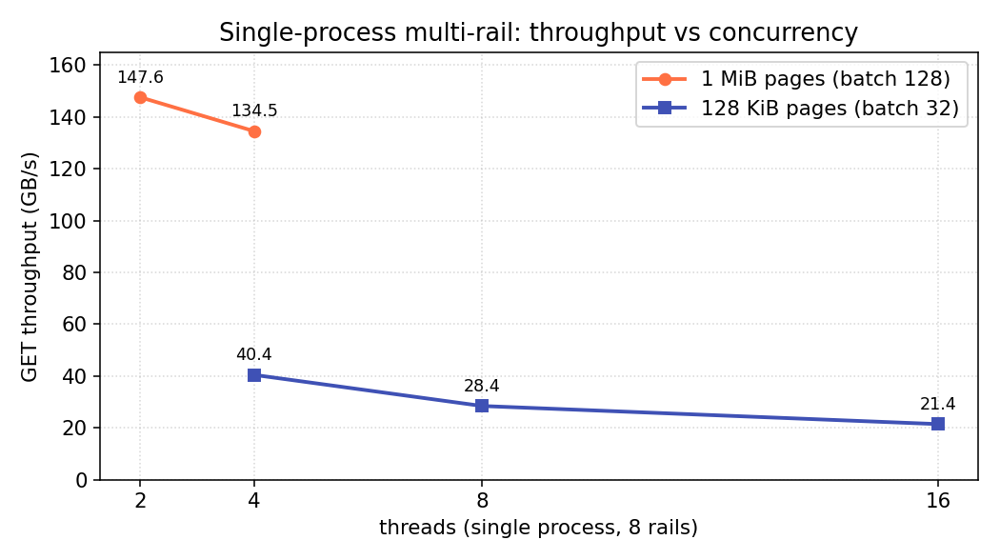
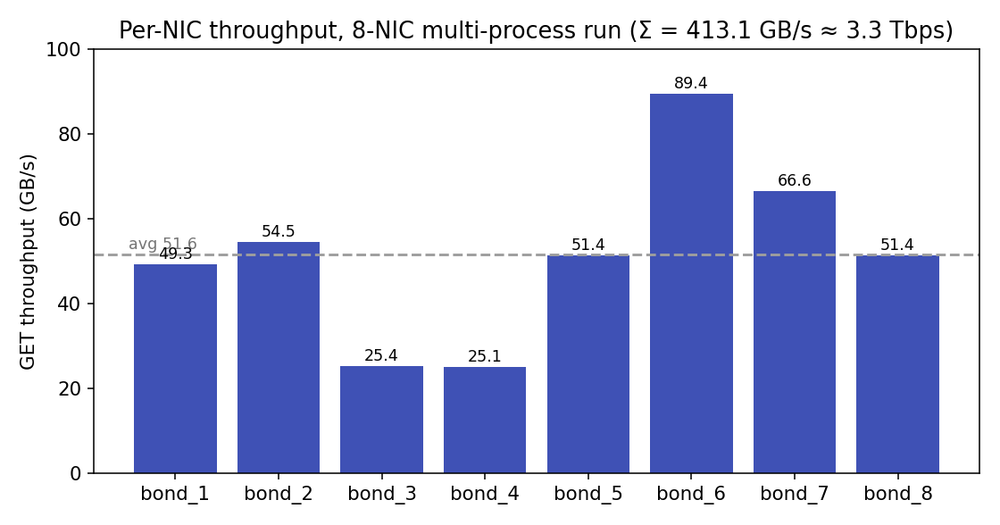

> **项目地址**：[flymysql.github.io/PeerCache](https://flymysql.github.io/PeerCache/zh/)
>
> 一句话介绍：一个**去中心化、点对点、RDMA 零拷贝的 SGLang L3（HiCache）存储后端**，专门做**跨请求、跨节点的 KV（前缀）缓存复用**。它提供和 Mooncake Store 类似的复用能力，但**没有中心化的 master 和 metadata 服务**。单卡能吃到裸 `ib_read_bw` 的 **94%**，整机 8 卡聚合 **413 GB/s（3.3 Tbps）**。

在上一篇 [《大模型推理的 PD 分离》](/post.html?slug=大模型推理的-pd-分离原理动机与-mooncake-的实现) 里，我把 prefill/decode 分离的来龙去脉和 Mooncake 的实现讲了一遍。这篇接着讲一个我自己动手写的东西：**PeerCache**——一个想把"KV 缓存跨节点复用"这件事做得更轻、更去中心化的 L3 后端。

不过开头要先纠正一个容易误解的点：**PeerCache 不是 PD 的搬运引擎**，它和 PD 是两件正交的事。下面会专门讲清楚。

---

## 一、它解决什么问题：跨请求的 KV 前缀复用

先说场景。LLM 推理里有大量请求**共享前缀**——系统提示词、few-shot 示例、多轮对话历史、RAG 文档、Agent 上下文……这些前缀对应的 KV 缓存其实是一样的，每来一个请求都重算一遍纯属浪费。

SGLang 的 RadixAttention 已经能在单机复用前缀 KV，HiCache 又把这套思路扩展成三层缓存——GPU 显存（L1）、主机内存（L2）、外部分布式存储（L3）。**PeerCache 就是这个 L3**：它让前缀 KV 不仅能在一台机器里复用，还能**跨节点**复用。

工作方式很简单：

- 生产节点把 KV 页发布进**自己的本地池**，并把一条很小的位置记录写进**分片在所有节点上的一致性哈希目录**；
- 任意节点查到 key 后，用**单边 RDMA READ** 直接零拷贝拉进自己的 buffer。

接入也很省事：用 `--hicache-storage-backend dynamic` 直接挂进 SGLang，**无需 patch SGLang**。

---

## 二、它不是什么：两个别混的正交维度

这是整篇里我最想强调的一点。一提到"跨节点搬 KV + RDMA + Mooncake"，很多人第一反应是 PD 分离里那条 **prefill → decode 的 KV 交接**。但那条路**不是** PeerCache 干的活。

- **PeerCache ≠ PD 搬运引擎。** 它不负责每个请求的 prefill→decode KV 交接——那条延迟敏感的 GPU→GPU 路径是 Mooncake / NIXL 通过 `--disaggregation-transfer-backend` 做的。
- **PeerCache ≠ 中心化存储。** 没有需要部署 / 扩容的 master 或元数据服务。

把两个维度摆在一起看就清楚了：

| 维度 | KV / 前缀复用（PeerCache） | PD 的 P→D 交接（Mooncake/NIXL） |
| --- | --- | --- |
| 范围 | 跨请求 / 跨节点 | 单个请求内 |
| 目标 | 省掉重复计算共享前缀 | 把 prefill 的 KV 交给 decode |
| 延迟 | 缓存型，可容忍主机暂存 | 延迟敏感，GPU→GPU 直传 |
| SGLang 参数 | `--hicache-storage-backend` | `--disaggregation-transfer-backend` |

所以这俩**不是二选一**：一个 PD 集群通常两者都用——**PeerCache 在 prefill 层做前缀复用，Mooncake / NIXL 做 P→D 交接**。这也是我上一篇讲 PD 分离时它们各自的位置。

---

## 三、为什么不直接用中心化的 KV 缓存

放对了维度之后，PeerCache 真正要对比的是那些**做 KV 复用、但靠中心 master / 中心元数据**的存储——比如 Mooncake Store、分布式模式的 LMCache。

它们都很成熟、能力也强，但形态决定了要养一套中心化协调设施：master 分配 / 跟踪对象，元数据服务存放 lookup，数据常常还要拷进专用托管池。PeerCache 的取舍是另一条路：**把中心节点全部砍掉，用一致性哈希把目录分散到每个节点上**。

| 维度 | 中心化存储 | PeerCache |
| --- | --- | --- |
| 元数据 | 中心 master / lookup 服务 | 一致性哈希 DHT，分片到所有节点 |
| 单点故障 | master 是 SPOF / 瓶颈 | 没有中心元数据节点 |
| 元数据吞吐 | 受 master 限制 | 随集群规模扩（每节点 ~1/N） |
| 数据放置 | 常需拷进托管池 | 留在生产节点本地 |
| 写路径 | 入池 + 协调 | 本地 memcpy + 一条小位置记录 |
| 读路径 | 经存储 / 引擎 | 单边 RDMA READ，零拷贝 |
| 要运行的服务 | master + worker | 仅内嵌发现（无独立 master） |
| 扩展 | 给协调者扩容 | 加节点 → 环自动 re-shard |

差别集中在两点：**目录是分片而不是中心存的**，**数据是留在生产者本地而不是搬进专用池的**。下面分别讲。

---

## 四、核心理念

我把整套设计浓缩成几条原则：

- **内嵌服务发现，没有独立 meta 节点。** 在所有节点上把 `discovery_addr` 配成同一个节点的 IP，那个节点会在**进程内**自动承担服务发现：别的节点向它注册、心跳、拉取实时成员列表。它这里**既不存数据，也不存元数据**——只是一个成员名册。
- **一致性哈希目录（DHT）。** 映射 `key -> {数据节点, 远端地址, rkey, 长度}` 通过对 key 取哈希分片到所有节点。写入方和读取方各自对 key 取哈希，就能独立地算出"这条记录归谁管"，不需要问任何人。
- **写入时数据留本地。** `set()` 把页面拷进节点本地的发布池（一次主机 memcpy，不走网络、不依赖 master），只把一条极小的位置记录推到目录归属者那里。
- **读取时单边 RDMA READ。** `get()` 先查目录拿到 `{addr, rkey, len}`，再发起一次零拷贝 `IBV_WR_RDMA_READ`，数据直接落进 SGLang 已经注册好的主机缓冲区。
- **磁盘持久化分层（L4）。** 被内存淘汰的页面可以落盘，之后再被读取时提升回内存。
- **内置监控。** Prometheus `/metrics` 端点 + 一个零依赖的 HTML 可视化页面。

---

## 五、双 MR 模型——一个绕不开的正确性问题

这是 PeerCache 里我觉得最值得讲的一个设计点。

直觉上，既然要做零拷贝 RDMA READ，那直接把 SGLang 的主机 KV 缓冲区注册成 MR、把它的地址发布到目录里，让远端来读不就行了？

**不行。** SGLang 的主机 KV 缓冲区是 **L2 层**，会被 HiCache 随时驱逐 / 覆盖。如果我把它的地址发布出去，远端 READ 可能会落到一个**已经被复用的页面**上——读到的是别的请求的 KV，这就是典型的悬空引用 / 数据损坏。

所以每个节点注册**两块**内存区域（MR）：

1. **接收 MR** = `mem_pool_host.kv_buffer`——`get` 时单边 READ 的**目标**（数据落进这里）。
2. **发布池 MR** = 后端自己持有、带 LRU 的主机内存池——远端节点 READ 的**来源**。

`set()` 时把页面 memcpy 进发布池（节点本地、不走网络），并把 `addr + rkey + len` 发布到目录。**从池里驱逐一个页面，会同时删掉对应的目录条目**——因此一条已发布的地址在它被驱逐之前始终有效，远端永远不会读到悬空地址。

这就是为什么写端那一次 memcpy 是**必要**的：它把"会被随时复用的 L2"和"我能保证生命周期的发布池"解耦开。这是为正确性付出的标准代价，而网络传输本身仍然是零拷贝。

---

## 六、读写数据流

### 写入路径

写入开销 = **一次本地 memcpy + 一次小目录 RPC**。没有 master，也没有 KV 数据的网络拷贝。

### 读取路径

如果目录显示数据就在读取方自己身上，读取会退化成一次本地 `memcpy`，完全不走网络。

### 一次"生产者 → 消费者"到底拷几次

只统计（庞大的）KV 数据的搬运，目录 RPC 只有几十字节，忽略不计：

| 操作 | KV 数据拷贝次数 | 发生了什么 |
| --- | --- | --- |
| `set`（写，生产者） | 1 次主机 memcpy | 页面从 SGLang 主机缓冲区 → 后端发布池 MR（节点本地，不走网络） |
| `get`（远端读） | 0 次 CPU 拷贝 | 单边 `IBV_WR_RDMA_READ`；网卡把字节从远端发布池直接 DMA 进读取方主机缓冲区 |
| `get`（数据已在本地） | 1 次主机 memcpy | 发布池 → 主机缓冲区，不走网络 |

所以一次跨节点 KV 传输的代价是：**写端一次主机 memcpy + 读端一次零拷贝 RDMA READ**。

---

## 七、控制面 / 数据面的分工

PeerCache 把实现干净地切成两半：**控制面用 Python（走 TCP）**，**数据面用 C++ / libibverbs（走 RDMA）**。

几个我比较在意的工程细节：

- **一致性哈希目录**：每个节点承载目录的一个分片，所有分片的并集才是完整目录，不存在中心存储。默认每节点 160 个虚拟节点（vnode）来均衡分布。`directory_replicas > 1`（默认 2）可以把每条条目写进接下来的 N 个归属者做高可用，读取时在副本间回退。
- **连接管理**：连接引导用极小的 TCP 握手交换 `QpInfo`（qp_num / psn / lid / gid），把设备选择和连接建立彻底解耦，随后 QP 走 INIT → RTR → RTS。每个对端维护一个**有界的通道池**（一个通道 = 一条 RC QP + 自己独立的 CQ），惰性创建、复用、用 `max_channels_per_peer` 封顶——既避免 O(N²) 全连接网格，又允许多个读取者并发读同一个对端。
- **并发模型**：服务端本就完全多线程，单边 RDMA READ 完全不耗响应方 CPU；客户端 `batch_read` 在整个 RDMA 传输期间释放 GIL，每个读取线程租一条独立通道（QP + 私有 CQ），N 个线程在 N 个 CQ 上各自 post/poll，没有共享 CQ 竞争。

---

## 八、磁盘分层（L4）：把淘汰的页面接住

内存池总是有限的，写满之后被 LRU 淘汰的页面通常就丢了。PeerCache 提供一个可选的磁盘分层把它们接住：

- **写透（异步）**：`set` 时页面落内存池后，会被排队异步写盘（默认 `/data/peercache/`，上限 `100GB`，磁盘自身也按 LRU 约束）。
- **淘汰 ≠ 删除**：内存池淘汰某页时，目录条目保留，只标记 `resident=false`（数据在盘上）。只有等磁盘也淘汰它，目录条目才真正删除。
- **读时提升**：`get` 解析到非驻留条目会触发提升——数据所属节点把页面从盘读回内存池，重新标记驻留，再正常提供零拷贝 READ。远端读则发一个 `data_promote` RPC 让所属节点先提升再返回新的 `{addr, rkey}`。

磁盘分层是可选的（`disk_enabled`），而且能优雅降级：如果 `disk_path` 建不出来就自动禁用，内存池退回"淘汰即删除"。

---

## 九、性能基线

下面这组数字来自一套特定的 8 卡 RoCE 环境，用内置的 `peercache-bench serve` / `drive` 双机工具测得（GET 路径，单边 RDMA READ 读 KV 页，MLA 布局）。**它展示的是方法论与曲线形态，不是性能保证**——请用复现命令在你自己的硬件上重跑。

### 测试环境

| 项 | 值 |
| --- | --- |
| 拓扑 | 2 台主机（生产者 / 消费者），跨机 RoCE |
| 网卡 | 8 × Mellanox ConnectX-7 `mlx5` RoCE，bond |
| RoCE | RoCEv2，GID index 3，MTU 4096 |
| 单卡线速 | ≈ 400 Gb/s（裸 READ 实测 392 Gbps） |
| CPU | 2 × AMD EPYC 9K84，96 核/路（192 核 / 384 线程） |
| 主机内存 | 2.2 TB（每 NUMA 节点 ≈ 1.16 TB） |
| 传输 | `--protocol rdma`，布局 `mla` |

### 总览：从单卡到整机

| 场景 | GET 吞吐 | 占单卡裸 RDMA | 说明 |
| --- | --- | --- | --- |
| 裸 `ib_read_bw`，1 卡，16 QP | 49.0 GB/s（392 Gbps） | 100% | 单卡硬件参考值（保守） |
| PeerCache，1 卡，8 进程 | 46.0 GB/s（368 Gbps） | 94% | 存储层开销 ≈ 6% |
| PeerCache，单进程，8 rail，1 MiB 页 | 147.6 GB/s（1.18 Tbps） | — | 受 GIL 限制；约 3 张卡的量 |
| PeerCache，8 卡，多进程，128 KiB 页 | 413.1 GB/s（3.3 Tbps） | — | 每卡 25–89 GB/s；受内存/PCIe/NUMA 限制 |

值得一提的是，满负载多进程下**单卡实际跑到了 89 GB/s**——上面 16-QP 的 `ib_read_bw` 只是一个保守的单卡参考值，并不是硬上限。

### 1 · 单卡——PeerCache 对比裸 RDMA

为衡量存储层引入的开销，把单卡的 PeerCache 和裸 fabric 直接对比：

| 测量 | GET 吞吐 |
| --- | --- |
| `ib_read_bw -q 16 -s 131072`（裸单边 READ） | 49.0 GB/s（392 Gbps） |
| PeerCache GET，128 KiB 页，8 进程 × 4 线程 | 46.0 GB/s（368 Gbps） |

PeerCache 落在裸 `ib_read_bw` 的 **~6% 以内**。这点差距来自目录查找 + 每批编排；开启 `--dir-cache-ttl` 后，热的、静态的工作集上目录 RPC 基本被摊掉。这说明零拷贝读路径上几乎没有引入额外开销。

### 2 · 单进程多卡（multi-rail）

设置 `--devices d1,…,d8`，一个进程就会每卡开一条 rail，并在一次释放 GIL 的 C++ 调用（`batch_read_multi`）里把每批 READ 横跨所有 rail 分发。

| 页大小 | batch | 峰值 | 最佳线程数 |
| --- | --- | --- | --- |
| 128 KiB | 32 | 40.4 GB/s | 4 |
| 1 MiB | 128 | 147.6 GB/s | 2 |

两点值得注意：

- **单进程被 GIL 限制**：吞吐在低线程数（2–4）就到峰值，线程越多反而下降——每批的 Python 编排被 GIL 串行化，加线程只增加争用。
- **大传输能摊薄这部分开销**：GIL 持有的开销是按调用算的、不是按字节，所以把页从 128 KiB 加到 1 MiB，单进程从 40 → 148 GB/s（约 3 张卡的量）——尽管两者都受 GIL 限制。

所以 multi-rail 让一个进程能用上多张卡，但单个 Python 进程吃不满全部 8 卡——那需要多进程。

### 3 · 整机——多进程跨 8 卡

生产形态（也是吃满每张卡的方式）是每卡一个进程组——正是 SGLang TP=8 部署的运行方式（8 个 rank，各绑本地网卡）。这里：**8 卡 × 每卡 8 个读进程，128 KiB 页**。

| 指标 | 值 |
| --- | --- |
| 聚合 GET | 413.1 GB/s（3.3 Tbps） |
| 单卡区间 | 25.1 – 89.4 GB/s（均值 ≈ 51.6） |
| 配置 | 8 卡 × 每卡 8 进程，128 KiB 页 |

聚合远超单进程（147 → 413 GB/s），而且单卡在这里跑到了 **89 GB/s**，所以已经不再受网卡限制——瓶颈是主机内存带宽 / PCIe，以及不均衡（两张卡只有 ~25 GB/s，其余 49–89）。本机上网卡 1–4 在 NUMA node 0、5–8 在 node 1，没绑核的读进程可能落到错误的节点、付出跨 NUMA 代价。用 `numactl` 把每个进程组绑到该网卡的 NUMA 节点，就能把慢的网卡拉回来、抬高聚合。

### 4 · GPUDirect RDMA：直接读进 GPU 显存

真实 SGLang 部署里 KV 缓冲区其实在 **GPU 显存**里。PeerCache 可以注册这块显存，让单边 READ 直接落进显存，**不经过主机内存中转**：缓冲区暴露 dmabuf fd 时用 `ibv_reg_dmabuf_mr` 注册，否则在加载了 `nvidia-peermem` 时直接注册设备虚拟地址。

实测（单进程，8 rail，1 MiB 页，读进显存）：**49.5 GB/s**，100% 命中（同条件下读进主机内存是 140 GB/s）。这个差距是**单 GPU 的 PCIe 瓶颈**——8 条 rail 全写进同一块 GPU，共享它那条 PCIe 链路（Gen5 x16 约 50 GB/s）。

关键在于：真实 SGLang TP=N 部署里每个 rank 读进**自己的** GPU，所以 GPUDirect 会随 GPU 数量**线性放大**（≈ N × 单 GPU PCIe 带宽），不会被单条链路卡住。

### 关键结论

- **单卡**：PeerCache ≈ 裸 `ib_read_bw` 的 94%——RDMA 路径接近最优。
- **GIL 是单进程的天花板**：用低线程数 + 大 batch / 大页把单进程压到最高；单进程吃不满全部网卡。
- **整机带宽需要多进程**（每卡一组），这与 SGLang 多 rank 部署形态一致，满负载下整机能到 413 GB/s。
- **超过约一张卡后**，瓶颈转移到内存 / PCIe / NUMA，不再是 fabric——绑 NUMA、均衡 bond 即可。

> 注：1 MiB 页是合成值，用来展示大传输时的余量；真实 MLA KV 页通常约 128 KiB。引用数字时务必标注页大小。

---

## 十、什么时候用，又主动舍弃了什么

去中心化不是免费的，得把得失都说清楚。

### 优势

- **元数据无单点故障 / 瓶颈**：中心化方案里每次 PUT/GET 都打到 master；PeerCache 把目录分片，元数据吞吐随集群增长，没有中心热点。
- **写路径轻、数据有局部性**：`set()` = 本地 memcpy + 一条小目录记录，不拷进中心池。
- **运维组件更少**：发现服务内嵌，没有 master 要部署、扩容、做 HA。
- **无协调者横向扩展**：新节点同时增容量和元数据吞吐，成员变化自动 re-shard 目录。
- **去中心的故障域**：挂一个节点只丢它那份分片，不会整个元数据服务瘫；`directory_replicas`（默认 2）还保留副本。

### 主动舍弃了什么

- **成熟度与生态**：Mooncake / LMCache 经过大规模打磨，淘汰 / 分层 / 可观测性更全、集成更广；PeerCache 更精简、更年轻。
- **全局放置决策**：中心 master 能做更聪明的全局淘汰 / 放置 / 负载均衡；PeerCache 只做"本地 + 哈希"决策。
- **生产者热点与数据冗余**：KV 字节留在生产节点，热 key 可能让该节点成读热点；而且 KV 数据本身默认**不复制**——生产节点宕了那份页就不可用（目录有副本、有 disk 层兜底，但 KV 字节没多副本）。中心池更容易摊平负载、做数据冗余。
- **驱逐竞争是安全降级**：池驱逐会删目录条目，任何解析到陈旧 / 缺失条目的读取都返回 miss，让 SGLang 重新计算——不会读到坏数据，但确实是一次缓存 miss。

### 一张决策表

| 你的情况 | 建议 |
| --- | --- |
| 想跨节点复用 KV、最少复杂度、不要 master | **PeerCache（聚合模式）** |
| 需要 P/D 物理解耦（扩缩 / SLO） | Mooncake/NIXL 做交接 + PeerCache 在 prefill 做复用 |
| 需要全局放置、丰富特性、强数据 HA | 成熟的中心化存储 |
| 提示词都唯一、无共享前缀 | 任何 KV 复用缓存都帮不上多少 |

最契合 PeerCache 的，是**聚合式（非 PD）+ 高前缀复用**的负载：系统提示词、few-shot、多轮历史、RAG、Agent 上下文——这里挂上 PeerCache 就是一个完整的共享缓存层，不用再养传输引擎；以及**想要类似 Mooncake-Store 的复用能力、但不想再养一个中心 master** 的团队。

---

## 十一、小结

PeerCache 想表达的其实是一个很朴素的观点：如果你要的只是"跨请求、跨节点复用 KV 前缀"，那么 master 和 metadata 服务并不是必须的——把目录用一致性哈希分散开、让数据留在生产者本地、用双 MR 模型保证发布地址的生命周期，就能在砍掉中心设施的同时拿到接近裸带宽的读性能（单卡 94%，整机 8 卡 413 GB/s）。它和 PD 的 P→D 交接是正交的两件事，在 PD 集群里两者可以同时用。

如果你也在折腾 SGLang 的 L3 后端，欢迎去 [项目主页](https://flymysql.github.io/PeerCache/zh/) 看看[定位对比](https://flymysql.github.io/PeerCache/zh/positioning/)、架构文档、性能基线和 SDK 参考，也欢迎在 issue 里交流。
