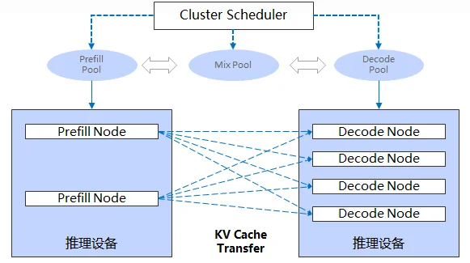

> 当我们谈论 LLM 推理优化时，绕不开一个关键词——**PD 分离**（Prefill-Decode Disaggregation）。这篇文章从第一性原理出发，讲清楚 PD 分离为什么会出现、它解决了什么问题，以及业界最完整的开源实现 Mooncake 是怎么落地的。





---

## 一、从一次推理说起

我们先回到最基础的问题：一次 LLM 推理请求，内部到底发生了什么？

当你向模型发送一句 prompt（比如"帮我写一首关于春天的诗"），模型的处理过程会分成两个**计算特征完全不同**的阶段：

### Prefill（预填充）阶段

模型需要先"读懂"你的整段输入。这个阶段会把 prompt 里所有 token **一次性**送进网络，并行计算它们之间的注意力，最终产出第一个输出 token。

- 因为是 N 个 token 一起算，矩阵运算是**矩阵 × 矩阵**（GEMM）
- 瓶颈在**算力**（FLOPs）——GPU 的 Tensor Core 火力全开
- 这个阶段的耗时，决定了用户看到第一个字的时间，也就是 **TTFT**（Time To First Token）

### Decode（解码）阶段

第一个 token 出来后，模型开始逐字往外蹦。每生成一个新 token，都要回顾前面所有的历史。

- 每步只算 1 个新 token，矩阵运算退化成**向量 × 矩阵**（GEMV）
- 瓶颈在**显存带宽**（HBM Bandwidth）——要把巨大的 KV cache 反复从显存读出来
- 这个阶段每一步的耗时，决定了出字速度，也就是 **ITL**（Inter-Token Latency）

### 一张表看清差异

| 维度 | Prefill | Decode |
|---|---|---|
| 计算形态 | 矩阵 × 矩阵（GEMM） | 向量 × 矩阵（GEMV） |
| 瓶颈资源 | 算力 FLOPs | 显存带宽 HBM BW |
| 适合的 batch | 小（1~4） | 大（32~256） |
| 适合的并行 | TP 大（缩 TTFT） | TP 小 + 多副本（提吞吐） |
| 适合的硬件 | 高算力卡（H100/H200） | 高带宽 / 高性价比卡 |
| 性能指标 | TTFT | ITL |

这张表是理解 PD 分离的全部基础——**两个阶段想要的东西，几乎处处相反**。

---

## 二、为什么不能混在一起跑

传统做法是 prefill 和 decode 跑在同一组 GPU 上，请求来了就排队处理。这种方式有几个躲不掉的硬伤。

### 1. 互相干扰：长 prefill 卡住所有 decode

想象一个场景：几十个用户正在流畅地逐字接收回复（decode 进行中），这时来了一个 4000 token 的长 prompt 请求。

为了处理这个长 prefill，GPU 被占用几百毫秒甚至上秒。在这段时间里，**所有正在 decode 的用户都卡住了**——他们的出字速度（ITL）瞬间抖动，体验崩坏。

这就是经典的 **Head-of-Line 阻塞**：一个重请求拖垮一片轻请求。

### 2. 资源错配：一半的硬件在摸鱼

- Prefill 阶段：算力拉满，但**显存带宽几乎闲置**
- Decode 阶段：带宽拉满，但**算力几乎闲置**

两个阶段混跑，意味着无论什么时刻，你的 GPU 总有一半的能力在浪费。在动辄几百上千张卡的集群里，这种浪费直接换算成 **30%~50% 的成本损失**。

### 3. 配置无法两全

- Prefill 喜欢**小 batch**（避免 padding 浪费），Decode 喜欢**大 batch**（榨干带宽）
- Prefill 倾向**大 TP**，Decode 倾向**小 TP + 多副本**

单一资源池只能取一个折中值，结果是两边都不满意。

---

## 三、PD 分离：把两个阶段拆开

既然两个阶段想要的东西相反，那就**物理上把它们分到两个独立的池子**：

```
                    ┌─────────────────┐
   请求 ──────────► │   调度器/路由     │
                    └────────┬────────┘
                             │
              ┌──────────────┴───────────────┐
              ▼                               ▼
      ┌───────────────┐               ┌───────────────┐
      │  Prefill 池    │               │  Decode 池     │
      │  高算力 GPU    │               │  高带宽 GPU    │
      │  大 TP、小 batch│              │  小 TP、大 batch│
      └───────┬───────┘               └───────▲───────┘
              │                               │
              │       KV cache 跨节点传输       │
              └───────────────────────────────┘
```

这样一来：

- **TTFT 和 ITL 彻底解耦**：长 prefill 不再干扰正在 decode 的请求
- **硬件按角色定制**：prefill 用高算力卡，decode 用高带宽 / 高性价比卡
- **批大小、并行度各自最优**：两个池子独立调参
- **独立扩缩容**：白天 prefill 压力大就加 prefill 节点，反之亦然

收益巨大，但天下没有免费的午餐。PD 分离引入了一个**唯一但棘手**的新问题：

> Prefill 算完的 KV cache，怎么高效地传给 decode 节点？

这就是整个 PD 分离工程的核心技术难点。

---

## 四、核心难题：KV cache 怎么传

先建立一个量级直觉。一次请求的 KV cache 有多大？

以一个 72B 模型、4K token 的 prompt 为例，KV cache 轻松到**几百 MB** 量级。而这份数据必须在 prefill 结束、decode 开始之前，从 prefill 节点搬到 decode 节点。

这一搬，卡在**关键路径**上：

```
[Prefill 计算] ──► [KV 传输] ──► [Decode 开始出字]
                      ↑
              这段时间 decode GPU 在干等
              这段时间直接计入 TTFT
```

所以 KV 传输方案的好坏，直接决定了：

1. **TTFT**：传得慢，用户等得久
2. **GPU 利用率**：传输期间 decode GPU 空转，烧钱
3. **集群吞吐天花板**：高并发下，KV 传输会吃掉大量 NIC 带宽

一个朴素的想法是：搞个中心化的存储服务，prefill 把 KV 写进去，decode 再读出来。但这样数据要**走两趟网络**（写一次 + 读一次），高并发下直接把 NIC 带宽消耗翻倍，吞吐天花板砍半。

更好的答案是 **P2P 直传**——让 decode 节点**直接**从 prefill 节点拉 KV，数据只走一趟。这正是 Mooncake 的核心思路。

---

## 五、Mooncake 的实现

[Mooncake](https://github.com/kvcache-ai/Mooncake) 是 Moonshot AI（月之暗面）开源的 KVCache 中心化推理架构，也是 Kimi 背后的生产级方案。它是目前开源世界里最完整的 PD 分离 + KV 复用实现。

### 5.1 整体分层

Mooncake 不是一个单体服务，而是一套分层组合：

```
┌──────────────────────────────────────────────────────────┐
│  应用层：sglang / vllm 的 prefill / decode worker         │
├──────────────────────────────────────────────────────────┤
│  KVCache 抽象：Mooncake Store（Master + Client lib）      │
├──────────────────────────────────────────────────────────┤
│  数据搬运：Transfer Engine（RDMA / NVLink / TCP）         │
├──────────────────────────────────────────────────────────┤
│  服务发现：metadata server（etcd / Redis / http）         │
└──────────────────────────────────────────────────────────┘
```

P2P 直传发生在最底层的 **Transfer Engine**，上面两层负责元数据与调度。我们自底向上看。

### 5.2 Transfer Engine：P2P 数据面的发动机

Transfer Engine 是 Mooncake 自研的高性能 RDMA 传输库，可以理解成一个「为 LLM 推理量身定制的、加强版的 UCX」。它的几个关键能力：

**统一内存视图**

通过 `RegisterMemory(addr, size, location)`，把不同位置的内存都注册成 RDMA 可直接访问的内存区域（MR）：

- GPU 显存（`cudaMalloc` 出来的）
- Host DRAM
- NVMe 映射的内存

`location` 参数携带 NUMA / PCIe 拓扑信息，供后续选路优化。

**Segment 抽象**

每个进程把自己注册的内存暴露成一个或多个 **Segment**，拥有全局唯一 ID（形如 `hostname:segment_name`）。其他节点只要知道这个 ID 和偏移量，就能远程读写。

**Multi-rail 多网卡聚合**

自动探测每张 NIC 的 PCIe 距离和 IB 链路状态，为一次传输挑选拓扑上最近的网卡，并把大块传输**拆分到多张网卡并发**，单连接就能打满多 NIC 的聚合带宽。

**GPU Direct RDMA**

这是最关键的一点。注册 GPU 显存后，配合 `nv_peermem`，KV cache 可以**直接从 prefill 节点的 GPU 显存，RDMA 到 decode 节点的 GPU 显存**，全程不经过 host 内存，零额外拷贝。

**核心 API**

```cpp
SubmitTransfer(
    target_segment_id,
    [(local_offset, remote_offset, length), ...]   // 支持 batch
);   // 异步提交，返回 handle
```

> 重点：**Transfer Engine 本身不是一个服务**，它是一个库。每个 worker 进程链接它、各自启动 RDMA endpoint，节点之间是**真正的点对点**通信。

### 5.3 KVCache Pool：解决「数据在哪」

光有搬运工还不够。Prefill 把 KV 算好放在自己的显存里，**decode 怎么知道该去哪个节点、哪个 segment、哪个偏移量拉数据**？

这就是 **Mooncake Store** 层的职责，核心是一个集中式的 **Master**，维护全局的 `key → 位置` 映射。

```
┌──────────────────────┐            ┌──────────────────────┐
│  Prefill Node P-1    │            │  Decode Node D-3     │
│  ┌────────────────┐  │            │  ┌────────────────┐  │
│  │ sglang worker  │  │            │  │ sglang worker  │  │
│  │ + Store Client │  │            │  │ + Store Client │  │
│  │ + Transfer Eng │  │            │  │ + Transfer Eng │  │
│  └────────────────┘  │            │  └────────────────┘  │
│  本地 DRAM/显存       │            │  本地 DRAM/显存       │
│  注册成 Segment "p1" │            │  注册成 Segment "d3" │
└──────┬───────────────┘            └──────┬───────────────┘
       │                                   │
       │   ① Put(key, "p1", offset)        │
       │     ┌────────────┐                │
       └────►│   Master   │◄───────────────┘
             │ key → 位置  │  ② Get(key) → ("p1", offset, len)
             └────────────┘
       │                                   │
       │  ③ Transfer Engine RDMA P2P 直传   │
       └─────────── 直连，不经过 Master ────┘
```

### 5.4 一次 P→D 传输的完整流程

1. **Prefill 完成**：KV cache 此刻就在 P-1 节点的显存里，这块 buffer 早已通过 `RegisterMemory` 注册成 segment
2. **上报元数据**：P-1 向 Master 上报「`key=req42_layer3` 在 segment `p1` 的 offset `0x1000`，长度 8MB」——**注意，数据本身一个字节都没动**
3. **调度 decode**：调度器把这个请求的 decode 阶段分配给 D-3
4. **查询元数据**：D-3 向 Master 发起 `Get(req42_layer3)`，拿到 `("p1", 0x1000, 8MB)`
5. **P2P 直传**：D-3 调用 `SubmitTransfer`，**直接通过 RDMA 从 P-1 的显存把 KV 读过来**，Master 全程不碰数据
6. **开始 decode**：D-3 拿到 KV，立即开始出字

整个过程里，**真正的大数据传输只发生一次**（步骤 5），而且是点对点的 1 跳 RDMA。Master 只参与了两次轻量的元数据交互（步骤 2、4），每次只有几十上百字节。

### 5.5 关键优化：元数据其实"不要钱"

你可能会问：Put 和 Get 这两次跟 Master 的交互，不是也多了网络往返吗？

确实多，但量级完全不同：

| | 元数据 RPC | KV 数据传输 |
|---|---|---|
| 数据量 | ~100 字节 | 几百 MB |
| 耗时 | 几十 µs（小包，纯延迟） | 几 ms（带宽受限） |
| 是否占带宽 | 几乎不占 | 占满 NIC |

更何况元数据这跳还能被进一步消化：

- **异步预取**：decode 节点在等 prefill 计算时，就能提前查好元数据
- **批量查询**：一个请求几十层 KV，元数据可以一次性批量取回
- **搭车调度消息**：在不需要全局 KV 复用的「纯 PD」模式下，连 Master 都可以省掉，把 KV 位置信息直接塞进"请求从 prefill 池转交到 decode 池"的那条调度消息里——这条消息本来就要发，元数据是**顺风车，零额外开销**

所以 Mooncake 的精髓不是"省跳数"，而是**省掉那一整次大数据传输**：数据原地待在 prefill 节点，decode 直接上门取，而不是先寄到中转仓库再去取。搬货的成本远大于打个电话问地址。

### 5.6 Layer-by-layer 流式传输

还有一个锦上添花的优化。Transformer 是逐层计算的，prefill **算完第 N 层，就能立刻把第 N 层的 KV 传出去**，不必等整个 prefill 结束。

这样 KV 传输的耗时就被**隐藏在了后续层的计算里**（overlap），decode 节点的 first layer 一就绪就能开始处理。在理想情况下，传输延迟几乎被完全吃掉，进一步压低 TTFT。

---

## 六、部署形态

Mooncake 在实际部署时有几种典型拓扑，按业务规模和需求选择。

### 形态 A：Pure PD（最小化）

只做 P→D 单次直传，不需要跨请求的 KV 复用。

- **不需要** Master，**不需要** etcd
- 直接使用底层 Transfer Engine API
- KV 位置信息走推理框架（如 sglang）自己的调度通道

sglang 原生的 PD 实现（基于 Mooncake Transfer Engine 或 NVIDIA NIXL）走的就是这条最简路线。

### 形态 B：PD + KVCache Pool（生产推荐）

既要 PD 直传，又要跨请求复用 KV（比如多轮对话、共享系统提示词的 prefix 缓存）。这是 Kimi 的生产姿势。

```
[P 节点]            [P 节点]            [D 节点]            [D 节点]
 worker             worker             worker             worker
 +store client      +store client      +store client      +store client
 +transfer engine   +transfer engine   +transfer engine   +transfer engine
     │                  │                  │                  │
     └──────────────────┴──── RDMA P2P ────┴──────────────────┘   ← 数据面
                              │
                ┌─────────────┴─────────────┐
                │  Master (1~3 台 HA)        │   ← 控制面
                │  metadata server (etcd)    │   ← 服务发现
                └────────────────────────────┘
```

一个容易混淆的点：**每个 P/D worker 进程链接了 Store Client 库，本身就充当了存储池中的一个节点**。它启动时会把自己的一段内存注册进全局池。所以——

> **不需要**单独部署 `mooncake_store_service` 这个独立进程。

只有当一台机器"不跑推理、纯粹想贡献内存当存储节点"时，才需要单独起 `mooncake_store_service`。

各组件清单：

| 组件 | 数量 | 是否必须 | 说明 |
|---|---|---|---|
| `mooncake_master` | 1~3（HA） | 必须 | 元数据路由，不参与数据面 |
| metadata server（etcd 等） | 1~3 | 必须 | 服务发现 |
| `mooncake_store_service` | 0 | 不必须 | 仅纯存储节点才需要 |
| 推理 worker | N | 必须 | 自带 store 角色 |

### 形态对比

| 部署方式 | Master | etcd | 独立 store service | 适用场景 |
|---|---|---|---|---|
| **Pure PD** | 否 | 否 | 否 | 只要 P→D 直传 |
| **PD + Pool** | 是 | 是 | 否 | PD 直传 + 跨请求复用 |

### sglang 集成示例

PD + Pool 模式下，每台 P/D 节点的启动配置：

```bash
python3 -m sglang.launch_server \
    --model-path /models/Qwen2.5-72B \
    --enable-hierarchical-cache \
    --hicache-storage-backend mooncake \
    --hicache-storage-backend-extra-config '{
        "local_hostname": "10.0.0.7",
        "metadata_server": "10.0.0.1:2379",
        "master_server_address": "10.0.0.1:50051",
        "protocol": "rdma",
        "device_name": "mlx5_bond_1,mlx5_bond_2,mlx5_bond_3,mlx5_bond_4",
        "global_segment_size": 107374182400
    }' \
    --pd-disaggregation-mode prefill   # decode 节点改成 decode
```

P 节点与 D 节点的差异：`local_hostname`（各自 IP）、`global_segment_size`（各自贡献多少内存）、`--pd-disaggregation-mode`（角色）。整个集群只需要一组 Master + etcd。

---

## 七、小结

回顾一下整篇文章的逻辑链：

1. **LLM 推理天然分两阶段**：prefill 吃算力，decode 吃带宽，两者诉求处处相反
2. **混跑的代价**：互相干扰、资源错配、配置无法两全，成本浪费 30%~50%
3. **PD 分离的思路**：物理上拆成两个池子，各取最优，TTFT 与 ITL 解耦
4. **唯一的新难题**：KV cache 怎么跨节点高效传输
5. **Mooncake 的答案**：Transfer Engine 做 P2P 直传（数据只走一趟、支持 GPU Direct、multi-rail、layer overlap），Master 做轻量元数据路由（µs 级、可异步、可搭车）

PD 分离的本质，是用一次**架构上的解耦**，换来 GPU 利用率和集群吞吐的大幅提升。而 Mooncake 用一套优雅的「数据面 P2P + 控制面元数据」分层，把其中最棘手的 KV 传输问题解得相当漂亮——**让数据待在原地，让需要的人直接上门取**。

---

## 参考资料

- [Mooncake 论文：A KVCache-centric Disaggregated Architecture for LLM Serving](https://arxiv.org/abs/2407.00079)
- [Mooncake 开源仓库](https://github.com/kvcache-ai/Mooncake)
- [Splitwise: Efficient Generative LLM Inference Using Phase Splitting](https://arxiv.org/abs/2311.18677)
- [DistServe: Disaggregating Prefill and Decoding for Goodput-optimized LLM Serving](https://arxiv.org/abs/2401.09670)
