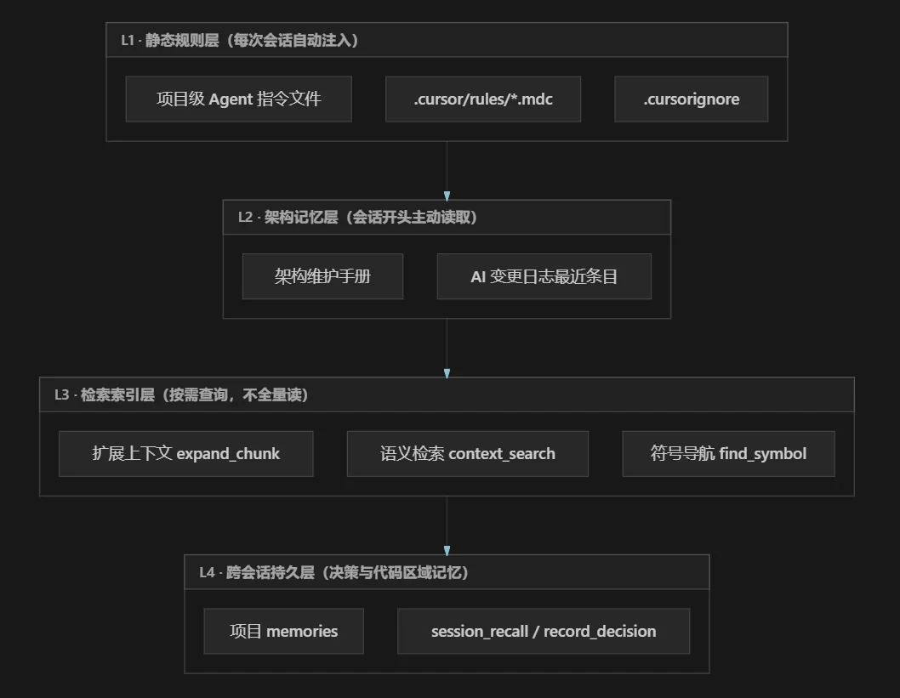
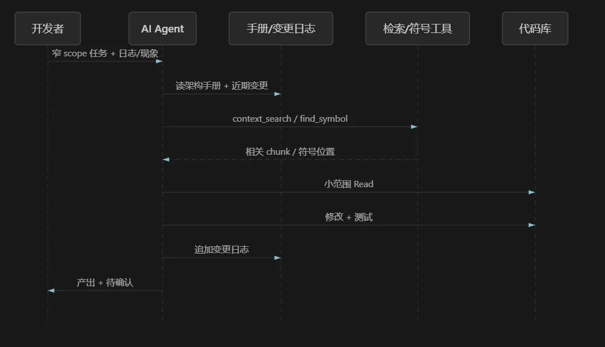
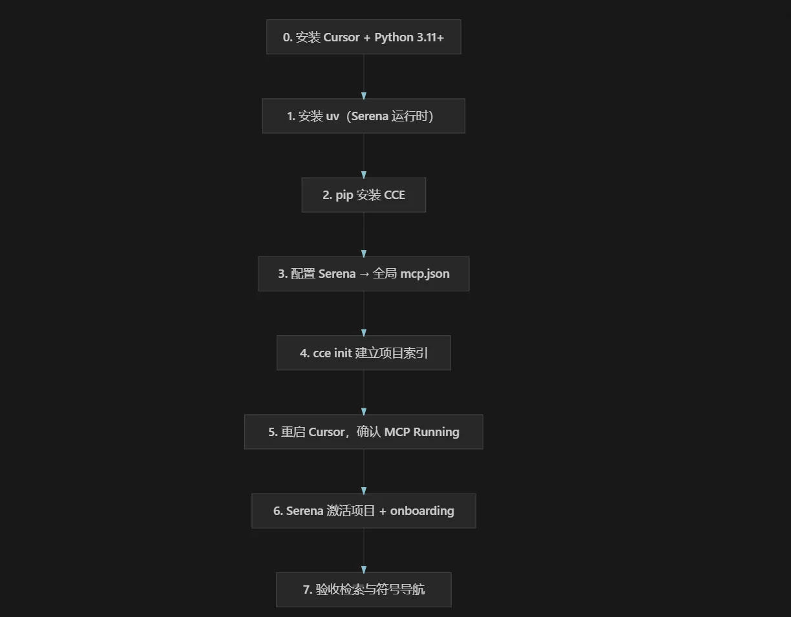
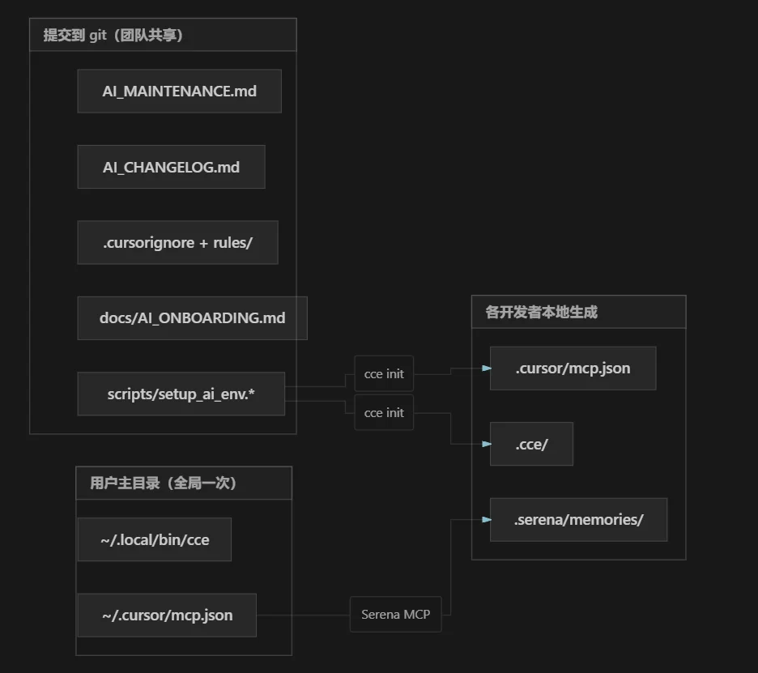
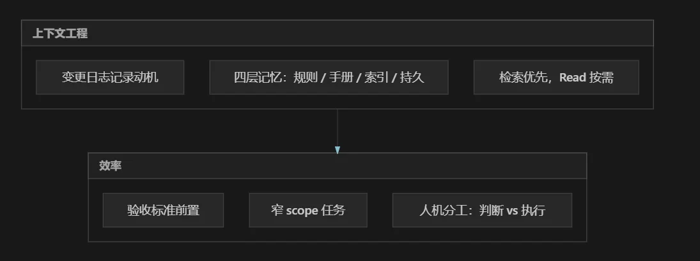

在复杂软件项目中引入 AI，常见困境不是模型不够强，而是**每次会话都在重复建立上下文**——Agent 全量读取大文件、反复追问架构、上一轮的结论无法延续、任务边界模糊导致改动扩散。这些问题叠加，表现为 token 消耗高、理解慢、产出不稳定。

实践表明：**AI 可以承担 substantial 的工程工作，但前提是项目具备可复用的协作基础设施，且任务有清晰边界。** 其中投入产出最高的一环，是**上下文工程（Context Engineering）**——不是写更好的 Prompt，而是为 AI 构建分层、可检索、可延续的项目记忆，并用工具与规则约束 Agent 的读码行为。

本文总结一套可迁移的方法：如何做上下文工程、如何节省 token 并让 AI 快速理解项目、如何在本地初始化 AI 协作环境，以及如何组织日常任务与故障排查。

---

## 典型问题与根因

在多层架构、多语言、长生命周期的项目中，早期使用 AI 往往遇到：

- Agent 倾向于全量读取数千行源文件，单次会话 token 消耗高且定位不准
- 每个新会话需重新解释架构边界、模块职责与不可触碰的约束
- 缺少变更记录，上一会话的排查结论与决策无法自然延续
- 任务 scope 不明确时，改动容易扩散至不相关模块

根因并非模型能力不足，而是**缺少面向 AI 的持久化项目记忆与检索机制**。上下文工程针对的正是这一缺口。

---

## 上下文工程：核心方法论

上下文工程的目标，是让 AI 在有限 token 预算内，尽快获得**正确、足够、可执行**的项目认知，而不是把整仓代码塞进上下文窗口。

推荐将项目上下文分为四层，由粗到细、由静到动：




### L1：规则与黑名单——控制 Agent 的默认行为

规则层解决「Agent 不该做什么」。写入 IDE 规则目录且设为 `alwaysApply` 的条目，会在每次会话自动生效，无需人工重复。

建议纳入的关键约束：

- 探索代码时**优先**语义检索与符号导航，禁止无目的地 bulk Read / Grep 全仓库
- 单次 Read 设置行数上限（如 200 行），编辑目标文件除外
- 禁止读取 build 产物、依赖目录、本地索引缓存等路径
- 未明确要求时不执行 git commit
- 代码变更后必须跑指定测试，并追加变更日志

配合 `.cursorignore`（与 `.gitignore` 对齐并扩展），将产物、锁文件、索引目录挡在 Agent 读路径之外。这一层几乎不消耗对话 token，但显著减少误读大文件的概率。

### L2：架构手册与变更日志——快速建立心智模型

规则层管行为，手册层管认知。建议每次会话的标准阅读顺序：

1. **架构维护手册**——系统分层、模块职责、关键约束、已知缺口、问题路由表（「出现某类症状时，优先查哪个模块」）
2. **变更日志顶部若干条**——近期变更动机、行为变化、测试情况与未竟事项

架构手册应**写给 Agent 查表用**，而非面向人类的散文。好的路由表能把「问题现象」直接映射到「首选代码入口」，避免 Agent 从底层向上逐层摸索。

变更日志每条记录变更动机而不仅是文件列表，滚动保留最近 N 条（如 50 条）。其作用是**压缩历史会话**：新会话读若干条即可接续上周工作，无需重放完整排查过程。

有 L2 时，新会话建立准确心智模型通常只需数分钟；无 L2 时，往往需长时间反复解释且仍易遗漏约束。

### L3：语义索引与符号导航——按需取码，不全量读

L3 是 token 节省的核心杠杆。原则：**理解代码用检索，编辑代码才 Read。**

| 场景 | 推荐方式 | 应避免 |
|------|----------|--------|
| 定位某业务逻辑的实现位置 | 语义检索 `context_search` | Read 整个大文件 |
| 查找某函数/类的全部引用 | 符号导航 `find_referencing_symbols` | Grep 全仓库再人工过滤 |
| 了解某函数的上下游依赖 | `related_context` | 连锁打开多个关联文件 |
| 检索片段不够，需看完整函数体 | `expand_chunk` | 直接 Read 整文件 |

语义检索返回带置信度的代码块（chunk），通常几十到一两百行，足以定位逻辑；仅当 chunk 不够或需要修改时，再对小范围做 Read。

符号导航适合强类型语言项目：查找定义、列出引用、获取文件符号概览。对单文件数千行的遗留模块，符号导航通常比纯文本搜索精度更高。

一次语义检索的 token 开销，往往是全量读取同主题文件的 1/10～1/50。索引建立后，效果随项目规模增大而更明显。

### L4：跨会话记忆——避免重复决策

L2 记录「项目发生了什么」，L4 记录「我们为什么这样选」。

- **项目 memories**（本地持久化）：onboarding 时写入架构概览、技术栈、常用命令、编码惯例、任务完成检查项。适合稳定、不常变的知识。
- **`session_recall` / `record_decision`**：适合架构选择、已否决方案、命名约定等决策性记忆。回答非平凡问题前先 recall，做出非显然决策后 record。
- **`record_code_area`**：标记某文件某区域是某功能的核心，便于后续快速定位。

L4 的价值在于：数周后遇到「当时为什么选这个方案」，不必重读代码推导，直接 recall 即可。

### 上下文工程的整体工作流

将四层串联，单次任务的推荐路径如下：





---

## Token 节省与高效产出

上下文工程落地后，token 节省来自多个环节的叠加，而非单一 Prompt 技巧。

### 省 token 的关键机制

**1. 用检索代替全文件阅读**

大型源文件（数千行）一次 Read 即可消耗数千～上万 token。语义检索返回相关片段，通常 100～300 行等效内容，且带相关性排序。

**2. 用手册代替口头解释**

架构、模块边界、禁忌约束写入维护手册后，每会话 Read 该文档即可，而非在对话中重复口述。对话 token 留给具体任务。

**3. 用变更日志代替重放排查过程**

「上周那个超时问题怎么修的」不需要再贴大量日志让 AI 重推。变更日志一条简短摘要即可接续。

**4. 用规则代替重复叮嘱**

「不要 commit」「不要读 build 目录」「先跑测试」写入 rules 后零对话成本生效。

**5. 用 scope 约束扩散**

任务限定目录范围与禁止修改项（如「只改 `src/auth/`，不修改 API 契约」），可避免 AI 打开不相关模块，减少连锁 Read。

**6. 监控节省效果**

若工具支持统计（如 `cce savings`），可查看检索次数与 token 节省，评估索引是否被有效使用。

### 高效产出的任务表述

token 节省与产出效率也取决于任务输入质量：

| 低效表述 | 问题 | 高效表述 |
|----------|------|----------|
| 优化整个项目 | scope 模糊，改动扩散 | 仅修改 `pkg/network/`，修复连接断开后在途请求未回调失败的问题 |
| 看看有没有 bug | 无检索入口 | 用 context_search 定位重试队列逻辑，检查失败时是否正确清理状态 |
| 帮我理解这个项目 | 触发大量 Read | 先读架构手册第 3 章，再说明请求链路中各层职责 |
| 修一下超时 | 缺现象与范围 | 单请求场景下接口阻塞 60s，优先查连接池与超时回调，参考变更日志最新条目 |

故障排查的有效输入模式：**完整日志 + 复现步骤 + 优先模块 + 已排除的假设**。开发者提供领域判断（如「已排除流量过载」），AI 负责沿代码链下钻。

### 会话内的 Read 预算意识

即使检索工具受限，也应遵守「渐进式取码」：

1. 先语义检索 / 符号导航定位
2. 需要更多细节时 expand chunk 或 Read 单个函数体
3. 确认编辑范围后再 Read 目标区间（建议控制单次行数）
4. 仅编辑时才需要较完整上下文，可用多次小范围 Read 代替一次大 Read

将上述纪律写入 rules 后，Agent 默认遵循，显著降低「一上来读完整个文件再开始想」的模式。

---

## 本地 AI 环境初始化

上下文工程的 L3（检索索引）与 L4（跨会话记忆）依赖本机工具链。本节面向**从未接触过目标仓库的开发者**，给出一套与具体项目无关、可逐步复现的初始化流程。

读完本节，你应能在任意代码仓库中完成：安装依赖 → 配置 MCP → 建立语义索引 → 激活符号导航 → 验收 Agent 是否按预期工作。

### 初始化完成后具备的能力

| 能力 | 依赖组件 | Agent 侧典型调用 |
|------|----------|------------------|
| 按语义查找代码 | CCE（Code Context Engine） | `context_search`、`expand_chunk`、`related_context` |
| 按符号追踪引用 | Serena MCP | `find_symbol`、`find_referencing_symbols` |
| 跨会话记住决策 | CCE + Serena memories | `session_recall`、`record_decision` |
| 约束 Agent 读码行为 | `.cursor/rules`、`.cursorignore` | 自动注入，无需每次口述 |

CCE 擅长「用自然语言问代码在哪」；Serena 擅长「这个函数被谁调用」。复杂项目建议**两者都配**。

### 整体流程概览





预计耗时：首次约 15～30 分钟（含索引构建，视仓库大小而定）。索引建立后，日常只需重启 IDE 即可使用。

---

### 第 0 步：前置条件

在开始之前确认：

- [ ] 已安装 [Cursor](https://cursor.com/)（或其他支持 MCP 的 IDE）
- [ ] 本机有 **Python 3.11 或更高版本**
- [ ] 能访问外网（下载 Python 包与 Serena）
- [ ] 已在 Cursor 中打开目标项目的**根目录**（含 `.git` 或顶层 `package.json` / `Cargo.toml` 等的那一层）

检查 Python 版本：

```bash
python3 --version
# 或依次尝试
python3.12 --version
python3.11 --version
```

若版本低于 3.11，请先升级 Python，否则后续 CCE 安装可能失败。

---

### 第 1 步：安装 uv（Serena 的运行时）

Serena 通过 `uvx` 启动，需要先安装 [uv](https://docs.astral.sh/uv/) 包管理器。

**Linux / macOS：**

```bash
curl -LsSf https://astral.sh/uv/install.sh | sh
```

**Windows（PowerShell）：**

```powershell
powershell -ExecutionPolicy ByPass -c "irm https://astral.sh/uv/install.ps1 | iex"
```

安装后确认 `uv` 在 PATH 中：

```bash
export PATH="$HOME/.local/bin:$PATH"   # Linux/macOS，建议写入 ~/.bashrc 或 ~/.zshrc
uv --version
```

Windows 下 `uv` 通常安装在 `%USERPROFILE%\.local\bin`，需确保该目录在系统 PATH 中。

---

### 第 2 步：安装 CCE（语义检索引擎）

CCE 提供代码语义索引与 `context_search` 能力。在用户目录下安装即可，**无需**写入项目仓库。

```bash
python3 -m pip install --user --upgrade "code-context-engine[local]"
```

**老系统 SQLite 兼容（可选）：** 若后续 `cce init` 报 `near "RETURNING": syntax error`，说明系统 SQLite 版本过旧（< 3.35），追加安装：

```bash
python3 -m pip install --user --upgrade pysqlite3-binary
```

安装后确认 `cce` 命令可用：

```bash
export PATH="$HOME/.local/bin:$PATH"
cce --version
```

若提示 `command not found`，说明 pip 的 user bin 目录不在 PATH。查找路径：

```bash
python3 -m site --user-base
# 将 <user-base>/bin 加入 PATH，例如：
export PATH="$(python3 -m site --user-base)/bin:$PATH"
```

---

### 第 3 步：配置 Serena MCP（全局，每人一次）

Serena 配置写在**用户全局** MCP 文件中，不随项目仓库分发。这样换项目时无需重复配置。

**配置文件路径：**

| 系统 | 路径 |
|------|------|
| Linux / macOS | `~/.cursor/mcp.json` |
| Windows | `%USERPROFILE%\.cursor\mcp.json` |

若文件不存在，新建一个空 JSON：`{"mcpServers": {}}`。

在 `mcpServers` 中加入 Serena 条目（若已有其他 MCP，合并即可，勿覆盖）：

```json
{
  "mcpServers": {
    "serena": {
      "command": "uvx",
      "args": [
        "--from",
        "git+https://github.com/oraios/serena",
        "serena",
        "start-mcp-server",
        "--context",
        "ide-assistant"
      ]
    }
  }
}
```

保存后**先不要验证**——还需完成第 4 步并重启 Cursor，MCP 才会加载。

---

### 第 4 步：在项目中初始化 CCE 索引

进入**你正在开发的仓库根目录**，执行：

```bash
cd /path/to/your-project
export PATH="$HOME/.local/bin:$PATH"
cce init --agent auto
```

该命令会：

1. 扫描项目源文件，构建语义索引（存入本地 `.cce/` 目录）
2. 在项目下生成 `.cursor/mcp.json`，注册 `context-engine` MCP 服务

生成的 `.cursor/mcp.json` 内容类似：

```json
{
  "mcpServers": {
    "context-engine": {
      "command": "/home/you/.local/bin/cce",
      "args": [
        "serve",
        "--project-dir",
        "/absolute/path/to/your-project"
      ]
    }
  }
}
```

注意：`--project-dir` 是本机绝对路径，因此该文件**不应提交到 git**，每位开发者本地各自生成。

**大仓库首次索引可能需数分钟**，请等待命令正常退出。

**跳过重索引（可选）：** 若你之前已索引过、仅重装 MCP，可手动按上面模板编写 `.cursor/mcp.json`，将 `command` 和 `--project-dir` 换成你的实际路径，无需重跑 `cce init`。

**索引更新：** 大量拉取代码后，在项目根目录执行：

```bash
cce index
```

---

### 第 5 步：重启 Cursor 并确认 MCP 状态

1. 完全退出 Cursor，或执行 **Command Palette → Developer: Reload Window**
2. 打开 **Settings → MCP**（或 Cursor 设置中的 MCP 面板）
3. 确认以下两项均为 **Running**（绿点）：
   - `serena`
   - `context-engine`

若显示 Failed 或 Stopped，见本文末尾「故障排查」。

可在终端验证 CCE 统计命令：

```bash
cce savings
```

首次运行显示 `0 queries` 属正常——Agent 调用 `context_search` 后才会累积。

---

### 第 6 步：Serena 项目激活与 onboarding

MCP 就绪后，在 Cursor Agent 对话框发送：

```
请用 Serena 激活当前项目，并运行 onboarding。
```

**激活（activate_project）** 让 Serena 将当前打开的目录注册为工作项目。

**onboarding** 是一次性任务：Agent 阅读项目结构，在本地 `.serena/memories/` 写入若干条持久记忆。建议涵盖：

| 记忆主题 | 内容示例 |
|----------|----------|
| 架构概览 | 分层结构、核心模块职责 |
| 技术栈 | 语言、构建工具、主要依赖 |
| 常用命令 | 构建、测试、lint 命令 |
| 编码惯例 | 命名、目录约定、禁止事项 |
| 任务完成检查项 | 改完代码必须跑哪些测试 |

首次 onboarding 会消耗较多 token；**之后各会话直接复用**，无需重复。

若项目已有团队维护的架构手册，可指示 Agent：「onboarding 时优先阅读 `AI_MAINTENANCE.md`（或你项目中的等效文档）」。

---

### 第 7 步：验收

按顺序确认以下各项：

**终端验收：**

```bash
export PATH="$HOME/.local/bin:$PATH"
cce savings          # 能执行即可
cce --version        # 有版本输出
uv --version         # 有版本输出
```

**MCP 验收：**

- [ ] Settings → MCP：`serena`、`context-engine` 均为 Running
- [ ] Agent 对话中可成功调用 `context_search`（不报错、有返回）
- [ ] Agent 对话中可成功调用 `find_symbol`（不报错、有返回）
- [ ] Serena onboarding 已完成（`.serena/memories/` 目录存在且非空）

**行为验收——发送试任务：**

```
请用 context_search 查找项目中负责认证/鉴权的代码，不要 Read 整个文件。
```

```
请用 find_symbol 查找 <某个你熟悉的核心类名> 的所有引用。
```

预期行为：Agent 先调用 MCP 工具，仅对小范围代码做 Read，而非一次性打开数千行源文件。

---

### 可选：配置 Agent 规则与读文件黑名单

上述步骤完成后，语义检索与符号导航已可用。若希望进一步约束 Agent 行为、节省 token，可在项目仓库中新增（并提交 git）：

**`.cursorignore`**——阻止 Agent 读取 build 产物、依赖目录：

```
node_modules/
dist/
build/
target/
.git/
__pycache__/
*.lock
.env
.cce/
.serena/
```

**`.cursor/rules/agent-context.mdc`**——示例规则（按需修改）：

```markdown
---
description: Agent context discipline
alwaysApply: true
---

- 探索代码时优先 context_search / find_symbol，禁止无目的 bulk Read
- 单次 Read 不超过 200 行（编辑目标文件除外）
- 未明确要求时不 git commit
- 代码变更后运行项目约定的测试命令
```

团队可将架构手册、变更日志模板一并纳入仓库，参见前文「上下文工程」L1/L2 层。

### 示例：仓库中的 AI 协作目录布局

以下是一个**成熟配置**的示例目录树，来源于真实复杂系统项目的实践，已隐去业务代码与产品名称。你可对照检查自己的仓库是否具备对应文件；缺失项可按需逐步补齐，不必一次到位。

```
my-project/                          # 仓库根目录
│
├── AI_MAINTENANCE.md                # [L2·进 git] 架构手册：分层、约束、问题路由表
├── AI_CHANGELOG.md                  # [L2·进 git] 变更日志：记录「为什么改」，滚动保留最近 N 条
├── CLAUDE.md                        # [L1·进 git] Agent 指令：CCE 用法、跨会话记忆规范
├── .cursorignore                    # [L1·进 git] Agent 读文件黑名单（build 产物、依赖、索引目录）
│
├── .cursor/
│   ├── mcp.json                     # [本地生成] cce init 产出，含本机绝对路径，不提交 git
│   ├── mcp.json.example             # [进 git] MCP 配置模板，路径用占位符
│   └── rules/
│       ├── agent-context.mdc        # [L1·进 git] 上下文纪律：检索优先、Read 上限、禁止擅自 commit
│       └── ai-env-bootstrap.mdc     # [L1·进 git] 环境自举：缺 MCP 时提示跑初始化脚本
│
├── docs/
│   ├── AI_ONBOARDING.md             # [进 git] 本地环境初始化操作手册（给人和 Agent 看）
│   └── AI_COLLABORATION_PRACTICE.md # [进 git] AI 协作方法论（可选，团队内部分享用）
│
├── scripts/
│   ├── setup_ai_env.sh              # [进 git] 一键初始化（Linux / macOS）
│   ├── setup_ai_env.ps1             # [进 git] 一键初始化（Windows）
│   ├── serena-mcp-snippet.json      # [进 git] Serena MCP 配置片段，合并到 ~/.cursor/mcp.json
│   └── cce-shim.py                  # [进 git] 老系统 SQLite 兼容（按需）
│
├── .cce/                            # [本地] CCE 语义索引，体量大，不提交 git
├── .serena/                         # [本地] Serena 项目记忆与缓存，不提交 git
│   └── memories/                    # onboarding 写入的持久记忆（架构、命令、惯例等）
│
├── src/                             # 业务源码（示例路径，按实际项目调整）
├── pkg/
├── tests/
└── ...                              # 其余普通工程目录

# ── 用户主目录（全局，每人一份，不随仓库分发）──

~/.cursor/
└── mcp.json                         # [全局] Serena 等跨项目 MCP 配置

~/.local/bin/
└── cce                              # CCE CLI（pip install 或 shim 脚本生成）
```

各层与目录的对应关系：





**新成员上手路径（结合上图）：**

1. `git clone` 拿到左侧「进 git」的全部文件
2. 执行 `scripts/setup_ai_env.sh`（或按本文第 1～4 步手动初始化）
3. 本地自动生成 `.cursor/mcp.json`、`.cce/`
4. 重启 Cursor → onboarding → 写入 `.serena/memories/`
5. 日常会话：Agent 自动读 `rules/` + `AI_MAINTENANCE.md`，用 `.cce/` 检索，用 `.serena/` 回忆

业务源码目录（`src/`、`pkg/` 等）与 AI 协作目录**并列存在、互不替代**：前者是要维护的产品，后者是让 Agent 高效理解前者的基础设施。

---

### 团队可选：封装一键初始化脚本

成熟团队可将第 1～4 步封装为 `scripts/setup_ai_env.sh`，新成员只需：

```bash
chmod +x scripts/setup_ai_env.sh
./scripts/setup_ai_env.sh
```

脚本典型职责：检测 Python → 安装 uv/CCE → 合并 Serena 到全局 mcp.json → 执行 `cce init`。但无论是否有脚本，**第 5～7 步（重启 IDE、确认 MCP、onboarding、验收）仍需人工完成**。

---

### 什么该进 git，什么留在本地

| 类型 | 进 git | 留本地 |
|------|--------|--------|
| `.cursorignore`、`.cursor/rules/` | ✅ | |
| 架构维护手册、变更日志、初始化脚本文档 | ✅ | |
| `mcp.json` 模板（路径用占位符） | ✅ | |
| 含本机绝对路径的 `.cursor/mcp.json` | | ✅ |
| `.cce/` 语义索引 | | ✅ |
| `.serena/` 记忆与缓存 | | ✅ |

原则：**共享规则与文档，各自生成索引与 MCP 配置。**

---

### 故障排查

| 现象 | 可能原因 | 处理 |
|------|----------|------|
| `cce: command not found` | pip bin 不在 PATH | `export PATH="$(python3 -m site --user-base)/bin:$PATH"` 并写入 shell 配置 |
| `near "RETURNING": syntax error` | 系统 SQLite < 3.35 | `pip install pysqlite3-binary` 后重跑 `cce init` |
| MCP 面板无 `serena` / `context-engine` | 未重启 IDE 或 mcp.json 路径错误 | 检查 `~/.cursor/mcp.json` 与项目 `.cursor/mcp.json`，Reload Window |
| MCP 显示 Failed | `uv` 不在 PATH，或网络问题 | 终端手动执行 `uvx --from git+https://github.com/oraios/serena serena start-mcp-server --context ide-assistant` 查看报错 |
| `context_search` 无结果或结果过时 | 索引未建立或代码已大改 | 在项目根目录执行 `cce index` |
| Agent 仍全文件 Read | MCP 未 Running，或 rules 未配置 | 确认 MCP 绿点；任务中显式写「先用 context_search，不要 Read 整个文件」 |
| Serena onboarding 失败 | 项目路径未激活 | 先让 Agent 执行 `activate_project`，再执行 onboarding |

---

### 初始化后的日常使用

环境就绪后，每次开新会话无需重复上述流程。仅需：

1. 用 Cursor 打开项目根目录
2. 确认 MCP 仍为 Running（偶尔更新 Cursor 后需 Reload）
3. 大规模拉代码后执行一次 `cce index`

日常协作节奏见下文「日常任务组织」。

---

## 日常任务组织

基础设施就绪后，推荐固定协作节奏：

```
明确 scope → 读手册/变更日志 → 检索定位 → 小范围 Read → 改动 → 测试 → 记录变更 → 人确认后 commit
```

### 优先级分层

全面审查类任务，可按维度生成报告并分级推进：

- **P0**：可导致挂死、数据错误或静默失败
- **P1**：影响关停、资源释放、连接与状态管理
- **P2**：性能优化、目录整理、文档维护

AI 适合广度扫描与问题枚举；**优先级决策由开发者基于业务上下文做出**。执行时逐项推进，避免一次改动过多文件。

可并行派发专项 review（并发安全、资源泄漏、错误处理、冗余逻辑），主 Agent 汇总后按 P0→P1→P2 排序执行。

### 人机分工

| 开发者负责 | AI 负责 |
|------------|---------|
| 业务判断、日志解读、优先级决策 | 代码定位、修改实现、测试执行 |
| 排除已验证的假设 | 沿调用链下钻 |
| 真机/集成环境验证 | 变更日志与文档起草 |
| 确认后 commit | 不擅自提交 |

---

## 故障排查协作模式

复杂故障的有效协作遵循固定模式，与具体技术栈无关。

**输入**：完整日志 + 复现步骤 + 优先检查的模块 + 已排除的假设。

**过程**：

1. 开发者给出领域判断，缩小排查方向（如排除过载、排除配置错误）
2. AI 沿调用链从现象反推到根因
3. 修复后写入变更日志，记录动机与验证方式

**典型分工示例**：

- 开发者观察到「仅特定配置下复现，其他配置正常」→ 指向条件分支或特性开关差异
- AI 定位到「错误路径未返回失败状态，调用方无限等待」→ 补充错误回调与超时兜底
- 结论记入变更日志 → 下次同类问题直接 recall，无需重走排查链

---

## AI 适合承担的工程任务类型

除功能开发与故障修复外，AI 也适合处理以下低创新、高琐碎的工作，前提是**零行为变化 + 测试验证**：

- 大文件按职责拆分，保持对外 API 不变
- 补充端到端验证脚本与运维辅助工具
- 目录重组与兼容层（shim）维护
- 命令与配置文档汇总

注意：AI 生成的文档与命令示例，**须经人工在实际环境执行核对**，不可默认正确。

---

## 核心原则





1. **先建上下文，再写代码。** 四层记忆到位后，AI 才能稳定产出。
2. **检索优先，全量 Read 是最后手段。** token 节省与定位精度的基础。
3. **任务需有明确边界。** 目录范围、禁止项、commit 策略写入 rules。
4. **变更记录动机。** 便于跨会话接续与回归分析。
5. **验收标准前置。** 核心逻辑变更跑项目约定的测试套件；无法执行时在变更日志注明原因与影响范围。

---

## 投入产出与最小起步

建设上下文工程基础设施，前期约需 1～2 天。收益体现在：

- 每会话重复解释架构的时间显著下降
- 代码阅读 token 可比无索引模式降低一个数量级
- 变更可追溯，跨会话协作成本降低
- 新成员 onboarding 收敛为「一条命令 + 重启 IDE」

不必一次性落地全部方案。建议优先级：

1. **`.cursorignore` + rules**——控制 Agent 不读什么、不做什么
2. **架构维护手册**——模块职责与约束（数页即可）
3. **变更日志**——每次变更记动机
4. **窄 scope 任务表述**
5. **语义检索 + 符号导航 + 一键初始化**——有精力再上

**持久化记忆与检索工具的优先级高于 Prompt 技巧。** 前者决定 AI 能否看见正确的代码，后者只在看见之后微调表达方式。

---

## 结语

AI 协作的效果，主要取决于是否建立了可持续的**上下文工程体系**，而非单轮 Prompt 的技巧。

将分层记忆（规则、手册、索引、持久化）、token 预算意识与明确任务边界结合，AI 才能在数分钟内理解项目并稳定产出。本地环境一条命令完成初始化后，语义检索与符号导航构成这套体系的执行基础。

建议路径：**先花约一天建设上下文工程基础设施并跑通本地初始化，再开展功能开发与故障修复。** 基础设施到位后，AI 可作为稳定的工程协作者，而非每轮需重新培训的临时助手。

---

*本文总结自复杂系统软件项目的 AI 协作实践，方法可迁移至任意规模与语言栈的项目。*
